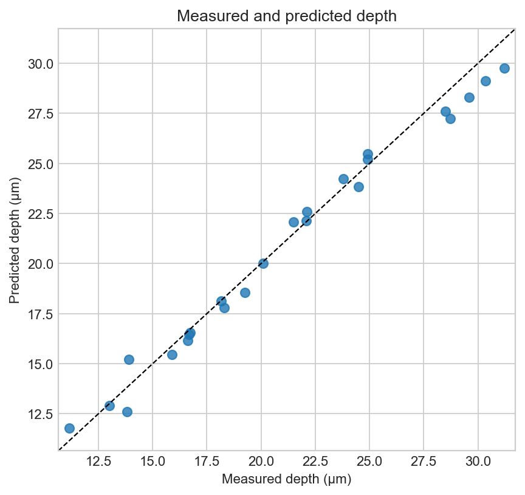
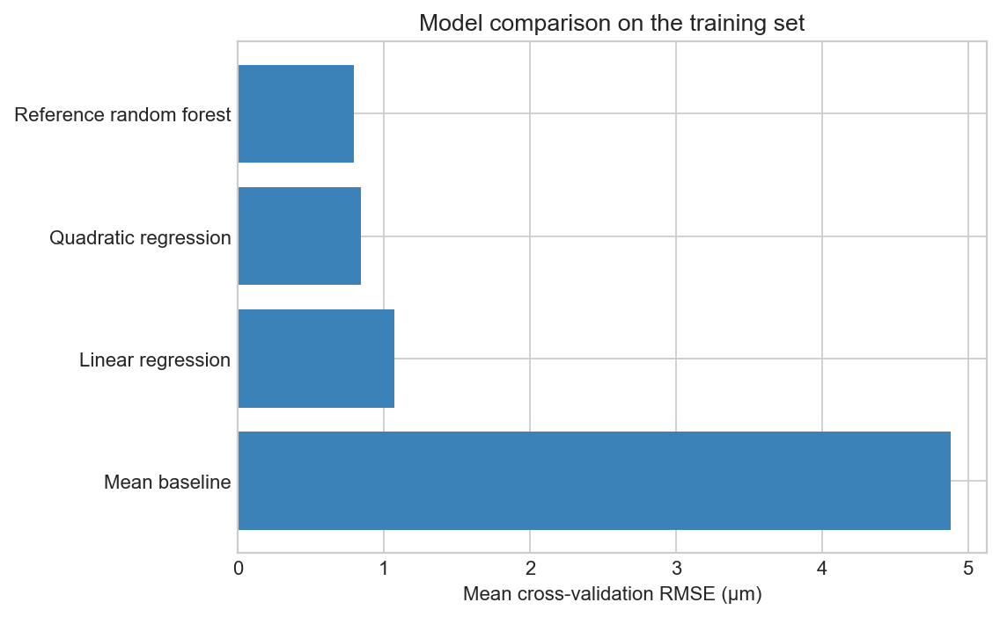

# Random Forest Prediction of Laser Ablation Depth

This project builds and evaluates a reproducible regression workflow for predicting nanosecond laser-ablation depth in 6061 aluminium alloy. It uses 120 experimental measurements and compares a tuned random forest with simple statistical baselines.



## Main result

| Held-out test metric | Tuned random forest |
| --- | ---: |
| R² | 0.9814 |
| MAE | 0.6373 μm |
| RMSE | 0.7864 μm |

The inputs are voltage (460–600 V) and pulse count (10–150); the target is maximum ablation depth. Laser power is excluded because it is calculated directly from voltage and would duplicate the same information.

## Workflow

- preserve a 20% held-out test set with random seed 42;
- compare mean, linear, quadratic, and reference random-forest baselines;
- tune the forest using five-fold cross-validation on the training set only;
- evaluate once on the held-out test set;
- inspect residuals and permutation feature importance; and
- test generalization by withholding complete voltage or pulse levels.



Pulse count is the dominant predictor. Grouped validation is harder than the random holdout, which shows that interpolation between observed settings is more reliable than prediction at entirely unseen levels.

## Repository relationship

This is the predictive-modelling stage of a two-repository project. The companion **[data-analysis-lab](https://github.com/runqing221/data-analysis-lab)** repository focuses on data preparation, exploratory relationships, interpolation, and scientific visualization.

The same dataset is retained here so the model can run independently. Any apparent method overlap is intentional: quadratic regression is used here only as a transparent baseline, whereas the companion analysis uses a quadratic surface to summarize experimental trends.

## Files

- `notebooks/random_forest_analysis.ipynb` — end-to-end modelling workflow
- `data/ablation_data.xlsx` — original measurement table
- `data/ablation_data.csv` — tidy model input
- `figures/` — model comparison, diagnostics, feature importance, and prediction surface
- `results/` — evaluation tables, tuning results, and held-out predictions

## Reproduce the results

```bash
python3 -m venv .venv
source .venv/bin/activate
pip install -r requirements.txt
jupyter lab
```

Start Jupyter from the repository root, open `notebooks/random_forest_analysis.ipynb`, and run all cells. The notebook uses fixed random seeds and writes derived tables and figures to the repository folders.

## Tools

Python · pandas · NumPy · scikit-learn · Matplotlib · Jupyter

## Limits

The model is intended only for interpolation within 460–600 V and 10–150 pulses. The small, regular experimental grid does not support claims of universal accuracy, and the grouped-validation results should be considered alongside the random holdout score.
